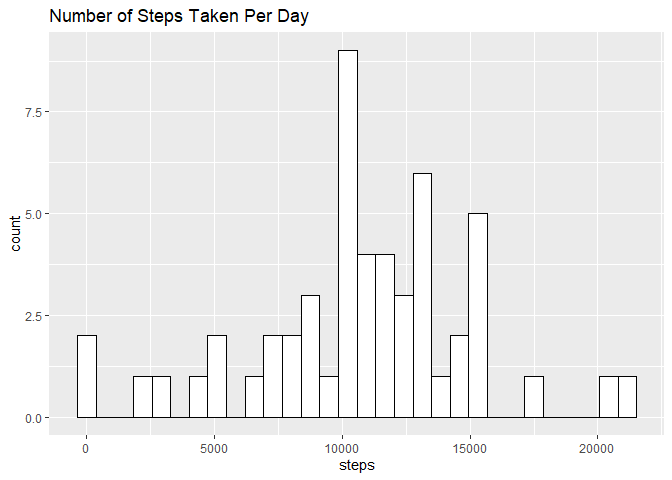
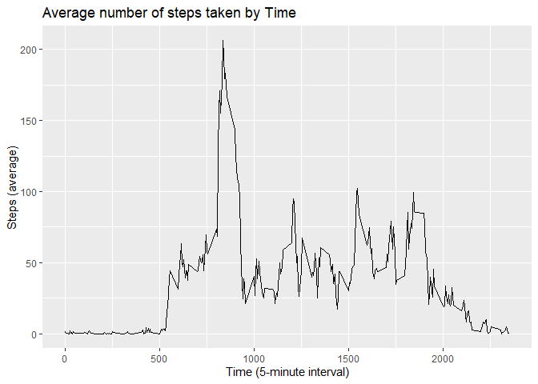
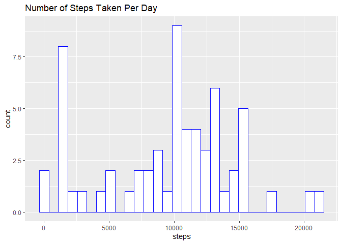
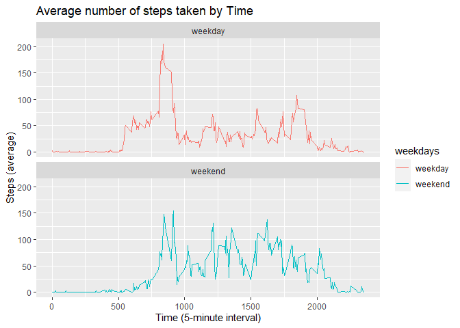

# Introduction

It is now possible to collect a large amount of data about personal movement using activity monitoring devices such as a Fitbit, Nike Fuelband, or Jawbone Up. These type of devices are part of the “quantified self” movement – a group of enthusiasts who take measurements about themselves regularly to improve their health, to find patterns in their behavior, or because they are tech geeks. But these data remain under-utilized both because the raw data are hard to obtain and there is a lack of statistical methods and software for processing and interpreting the data.

This assignment makes use of data from a personal activity monitoring device. This device collects data at 5 minute intervals through out the day. The data consists of two months of data from an anonymous individual collected during the months of October and November, 2012 and include the number of steps taken in 5 minute intervals each day.

The data for this assignment can be downloaded from the course web site:

-   Dataset: [Activity monitoring data](https://d396qusza40orc.cloudfront.net/repdata%2Fdata%2Factivity.zip)

The variables included in this dataset are:

* steps: Number of steps taking in a 5-minute interval (missing values are coded as 𝙽𝙰)
* date: The date on which the measurement was taken in YYYY-MM-DD format
* interval: Identifier for the 5-minute interval in which measurement was taken 

The dataset is stored in a comma-separated-value (CSV) file and there are a total of 17,568 observations in this dataset.

# Load the required packages

```r
library(dplyr)
library(ggplot2)
library(scales)
library(lubridate)
```

## Loading and preprocessing the data
For this case we have download and located file in the working directory. We also explore the type of the data and variable inside the data.

```r
unzip("activity.zip")
data <- read.csv("activity.csv")
head(data)
```

```
##   steps       date interval
## 1    NA 2012-10-01        0
## 2    NA 2012-10-01        5
## 3    NA 2012-10-01       10
## 4    NA 2012-10-01       15
## 5    NA 2012-10-01       20
## 6    NA 2012-10-01       25
```

```r
dim(data)
```

```
## [1] 17568     3
```

```r
names(data)
```

```
## [1] "steps"    "date"     "interval"
```

```r
str(data)
```

```
## 'data.frame':	17568 obs. of  3 variables:
##  $ steps   : int  NA NA NA NA NA NA NA NA NA NA ...
##  $ date    : chr  "2012-10-01" "2012-10-01" "2012-10-01" "2012-10-01" ...
##  $ interval: int  0 5 10 15 20 25 30 35 40 45 ...
```

Since the date is loaded as char variable we need to change it as data using lubridate packages

```r
data$date <- ymd(data$date)
```

## What is mean total number of steps taken per day?
To answer this question, we need to obtain the mean of overall step, we need to sum up the number of steps every interval within day to obtain steps in a day. After that we can create histogram to show the pattern of the data. Finally we can obtain mean and also median of total number of steps taken every day.

### 1. Calculate the total number of steps taken per day

```r
data_agg <-  data |>
  group_by(date) |>
  summarise(steps = sum(steps))
```

### 2. Make a histogram of total number of steps taken each day

```r
ggplot(data = data_agg, aes(x = steps)) + geom_histogram(color="black", fill="white") +
  labs(title = "Number of Steps Taken Per Day")
```

<!-- -->


### 3. Calculate the mean and median of number of steps taken per day

```r
data_agg |>
  summarise(mean_steps = mean(steps, na.rm = TRUE), med_steps = median(steps, na.rm = TRUE))
```

```
## # A tibble: 1 × 2
##   mean_steps med_steps
##        <dbl>     <int>
## 1     10766.     10765
```
from the result above we can find the mean value is not different with the median value means the skewness of the data distribution is not severe or quite normally distribute.


## What is the average daily activity pattern?
To answer this question, we need to generate mean of steps for each interval within day. To get a clearer 
pattern we can plot it into a line chart to analyze more about the data such as to know interval with the highest mean of steps.

### 1. Make a time series plot of 5-minute interval (x-axis) and average number of steps taken (y-axis)

```r
data_int <- data |>
  group_by(interval) |>
  summarise(steps = mean(steps, na.rm = TRUE))
```

plot the data

```r
ggplot(data = data_int, aes(x = interval, y = steps)) + geom_line(type = "1") +
  labs(title = "Average number of steps taken by Time", y = "Steps (average)", x = "Time (5-minute interval)")
```

<!-- -->


### 2. Which 5-minute interval contains the maximum of steps?

```r
data_int |>
  arrange(desc(steps)) |>
  slice(1:5)
```

```
## # A tibble: 5 × 2
##   interval steps
##      <int> <dbl>
## 1      835  206.
## 2      840  196.
## 3      850  183.
## 4      845  180.
## 5      830  177.
```
interval with the highest average steps is 835 with value 206.17


## Imputing missing values
### 1. Calculate  the total number of rows with NA

```r
sum(is.na(data$steps))
```

```
## [1] 2304
```
There is about 2.304 rows with missing steps value


### 2. Strategy for filling in all of the missing values in the dataset
for this strategy we will replace the NAs with the median of each interval. 
Why interval? because when we want to use date some result generate NaN or not a number result because
there is a date that all of interval have a NA value.

We will using dplyr package 
to group data by interval, generate the median and replace steps with median value if steps is NA


### 3. Create a new dataset but with missing data filled in

```r
data_fill <- data |>
  group_by(interval) |>
  mutate(steps = ifelse(is.na(steps),median(steps,na.rm = TRUE), steps))

head(data_fill)
```

```
## # A tibble: 6 × 3
## # Groups:   interval [6]
##   steps date       interval
##   <int> <date>        <int>
## 1     0 2012-10-01        0
## 2     0 2012-10-01        5
## 3     0 2012-10-01       10
## 4     0 2012-10-01       15
## 5     0 2012-10-01       20
## 6     0 2012-10-01       25
```

### 4. Make histogram and report total number of steps taken each day
Just like the previous steps, we grouped data by date and calculated mean for each day.

```r
data_fill_agg <- data_fill |>
  group_by(date) |>
  summarise(steps = sum(steps))
```


```r
ggplot(data = data_fill_agg, aes(x = steps)) + geom_histogram(color="blue", fill="white") +
  labs(title = "Number of Steps Taken Per Day")
```

<!-- -->

The histogram above is not quite different compare to previous but there is a increase number of steps between 0 and 5000
where most of it comes from the median value of interval that filled the NA rows.


```r
data_fill_agg |>
  summarise(mean_steps = mean(steps, na.rm = TRUE), med_steps = median(steps, na.rm = TRUE))
```

```
## # A tibble: 1 × 2
##   mean_steps med_steps
##        <dbl>     <int>
## 1      9504.     10395
```
using the median of steps for each interval, the mean and median steps is lower compare to previous value. 

## Are there differences in activity patterns between weekdays and weekends?

### 1. Create a new factor variable in the dataset with two levels – “weekday” and “weekend”
we create a dummy variable weekend that show value 1 if it's weekend and 0 if weekday. Variable day use to help generate
the dummy data using weekday() function from R. 

```r
data_fill_date <- data_fill |>
  mutate(day = weekdays(date, abbreviate = TRUE)) |>
  mutate(weekdays = ifelse(day == "Sat" | day == "Sun", "weekend", "weekday"))
```

### 2. Make a panel plot containing a time series plot
We will compare the average daily steps for weekend and weekday. The x-axis is interval and the y-axis 
is the number of steps.


```r
data_fill_int <- data_fill_date |>
  group_by(interval, weekdays) |>
  summarise(steps = mean(steps, na.rm = TRUE))
```


```r
ggplot(data = data_fill_int, aes(x = interval, y = steps, color = weekdays)) + geom_line(type = "1") +
  labs(title = "Average number of steps taken by Time", y = "Steps (average)", x = "Time (5-minute interval)") +
  facet_wrap(.~weekdays, ncol = 1)
```

<!-- -->

According to the line chart, there is higher steps in weekday in the morning about 05:00 to 10:00 and in weekends 
there is higher steps in the afternoon compare to weekday in 15:00 to 20:00 assuming people going out.


